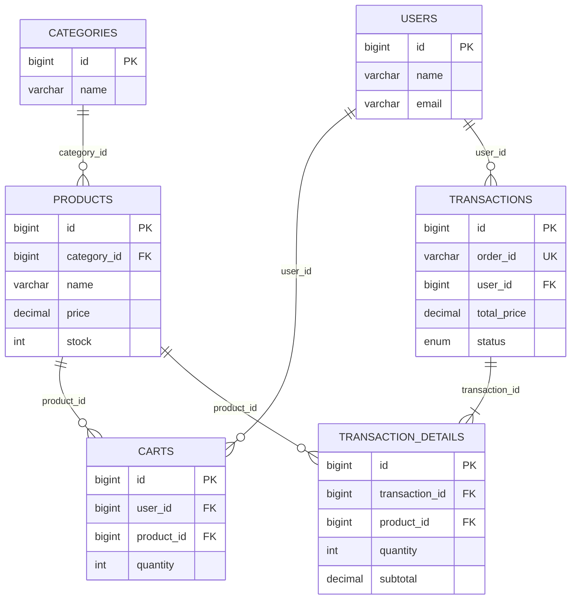

# Naskah PPT (maksimal 4 slide)

## Slide 1 — Gambaran Umum Sistem

### RattanHandmade: Aplikasi Penjualan Produk Kayu, Rotan, dan Sintetis

**Latar belakang singkat**  
RattanHandmade adalah aplikasi web yang menyimpan data kategori, produk, stok, keranjang belanja, dan pesanan dalam basis data. Nama dan ruang lingkup tersebut tertulis di `README.md`; halaman aplikasi juga menunjukkan katalog produk, keranjang, checkout, dan panel admin.

**Proses bisnis yang diimplementasikan**

1. Admin login melalui `/admin/login`, lalu melakukan CRUD produk dan melihat daftar pesanan.
2. Customer register/login, melihat produk beserta kategorinya, lalu memasukkan produk ke keranjang.
3. Saat checkout, sistem memeriksa stok, membuat transaksi serta detail transaksi, mengurangi stok produk, kemudian menghapus isi keranjang customer.
4. Admin memperbarui status pesanan: *Menunggu Pembayaran*, *Pembayaran Dikonfirmasi*, *Diproses*, *Dikirim*, *Selesai*, atau *Dibatalkan*.

**Tujuan pengembangan aplikasi basis data**  
Menyediakan penyimpanan terstruktur untuk katalog dan pesanan, serta mendukung validasi stok ketika customer menambah produk ke keranjang dan ketika checkout.

> Sumber proyek: `routes/web.php`, `CartController.php`, `CheckoutController.php`, dan `OrderController.php`.

---

## Slide 2 — Analisis Tools dan Komponen

| Bagian yang diminta | Tools/komponen yang benar-benar dipakai | Keterangan berdasarkan proyek |
|---|---|---|
| **DBMS** | **MySQL** | README menyebut MySQL; migration menggunakan sintaks MySQL seperti `ALTER TABLE ... MODIFY`, `ENUM`, dan `CREATE PROCEDURE`. |
| **Tools perancangan basis data** | **Laravel Migration** | Tabel, primary key, foreign key, unique constraint, dan stored procedure didefinisikan pada folder `database/migrations`. Tidak ditemukan file rancangan dari tools visual lain dalam repository. |
| **Library/komponen database** | **Laravel Eloquent ORM** dan `DB` Facade | Model `User`, `Product`, `Cart`, `Transaction`, dan lain-lain merepresentasikan tabel. `DB` digunakan untuk transaksi dan pemanggilan procedure. |
| **Framework aplikasi** | **Laravel 10 + PHP 8.1** | Tercantum dalam `composer.json`. |
| **Komponen antarmuka** | **Blade, Tailwind CSS, Vite, Alpine.js** | Tercantum dalam folder `resources/views`, `package.json`, dan konfigurasi proyek. |
| **Komponen pendukung** | **Laravel Breeze** dan **PHPUnit** | Breeze tersedia di dependency; pengujian tersedia pada `tests/Feature`. |

**Alasan pemakaian dalam proyek:** Laravel menyediakan migration agar struktur database dapat dibuat ulang, Eloquent untuk mengakses relasi tabel dari controller, dan MySQL diperlukan untuk procedure `update_transaction_status` yang dipanggil oleh modul pesanan admin.

---

## Slide 3 — Struktur Data

**Tabel dan struktur atribut yang dibuat melalui migration**

| Entitas/tabel | Atribut dan tipe data | Primary key, foreign key, dan constraint |
|---|---|---|
| `users` | `id BIGINT UNSIGNED`, `name VARCHAR(255)`, `email VARCHAR(255)`, `email_verified_at TIMESTAMP NULL`, `password VARCHAR(255)`, `role ENUM('admin','customer')`, `remember_token VARCHAR(100) NULL`, timestamps | PK: `id`; UNIQUE: `email`. |
| `admins` | `id BIGINT UNSIGNED`, `name VARCHAR(255)`, `email VARCHAR(255)`, `email_verified_at TIMESTAMP NULL`, `password VARCHAR(255)`, `remember_token VARCHAR(100) NULL`, timestamps | PK: `id`; UNIQUE: `email`. Tabel ini dipakai guard admin dan tidak memiliki FK. |
| `categories` | `id BIGINT UNSIGNED`, `name VARCHAR(255)`, timestamps | PK: `id`. |
| `products` | `id BIGINT UNSIGNED`, `category_id BIGINT UNSIGNED`, `name VARCHAR(255)`, `price DECIMAL(15,2)`, `stock INT UNSIGNED`, `description TEXT NULL`, `image_path VARCHAR(255) NULL`, timestamps | PK: `id`; FK: `category_id → categories.id`; hapus kategori dibatasi (`RESTRICT`). |
| `carts` | `id BIGINT UNSIGNED`, `user_id BIGINT UNSIGNED`, `product_id BIGINT UNSIGNED`, `quantity INT UNSIGNED`, timestamps | PK: `id`; FK: `user_id → users.id`, `product_id → products.id`; UNIQUE (`user_id`, `product_id`); kedua FK memakai `CASCADE`. |
| `transactions` | `id BIGINT UNSIGNED`, `order_id VARCHAR(255)`, `user_id BIGINT UNSIGNED`, `total_price DECIMAL(15,2)`, `status ENUM(...)`, timestamps | PK: `id`; UNIQUE: `order_id`; FK: `user_id → users.id` (`CASCADE`). |
| `transaction_details` | `id BIGINT UNSIGNED`, `transaction_id BIGINT UNSIGNED`, `product_id BIGINT UNSIGNED`, `quantity INT UNSIGNED`, `subtotal DECIMAL(15,2)`, timestamps | PK: `id`; FK: `transaction_id → transactions.id` (`CASCADE`) dan `product_id → products.id` (`RESTRICT`). |

**Struktur data yang dipakai:** model relasional. Nilai `price`, `subtotal`, dan `total_price` memakai `DECIMAL(15,2)`; nilai stok dan kuantitas memakai `INT UNSIGNED`; status transaksi dibatasi oleh `ENUM` dengan enam nilai pada Slide 1.

---

## Slide 4 — Implementasi Rancangan Entitas dan Relasi

**ERD / relational diagram**

**Hubungan dan kardinalitas**

- `categories` 1:M `products`.
- `users` 1:M `carts` dan `users` 1:M `transactions`.
- `products` 1:M `carts` dan `products` 1:M `transaction_details`.
- `transactions` 1:M `transaction_details`.
- Tidak ada relasi FK yang dibuat untuk tabel `admins`; tabel tersebut digunakan khusus autentikasi admin.

**Gambaran implementasi ke basis data**  
Migration membuat tabel dan relasinya di MySQL. Pada `CheckoutController`, kode menjalankan `DB::beginTransaction()`: validasi stok → simpan `transactions` → simpan `transaction_details` → kurangi `products.stock` → hapus `carts` customer → `commit`; jika error dijalankan `rollBack`. Pada `OrderController`, status pesanan diperbarui melalui `CALL update_transaction_status(?, ?)`.
